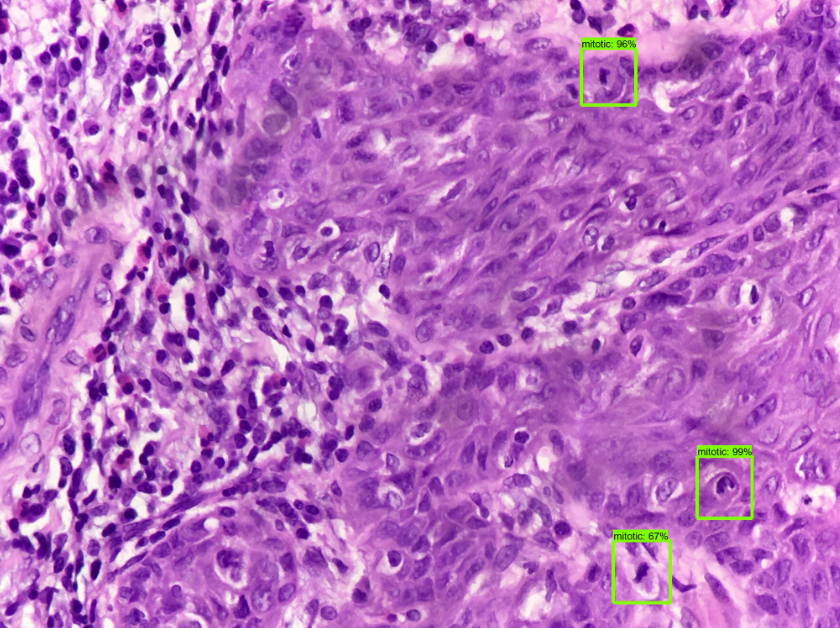

# SmartPath

## Mitotic Cell Detection on Low Resolution pathology images using Faster R-CNN.
The vast majority of existing image analysis algorithms are trained on slide images acquired via expensive Whole-SlideImaging (WSI) scanners. High scanner cost is a key bottleneck
preventing large-scale adoption of automated digital pathology solutions in the developing countries. In this work, we investigate
the possibility of performing automated image analysis and quantification using images captured from the eyepiece of a microscope via a smartphone.

## Flask App
The app is built using python's flask framework and screenshot of homepage is shown below:

## Architecture

For getting the mitotic cell predictions, we used a Faster R-CNN model. The qunatification workflow of the system is shown below:
 

## Predictions

Prediction produced by the model on some sample images are shown below. Left is the input input and on the right is the image with predictions.

## Results
Quantification results compared with the ICPR high-res dataset are shown in the tables below:

